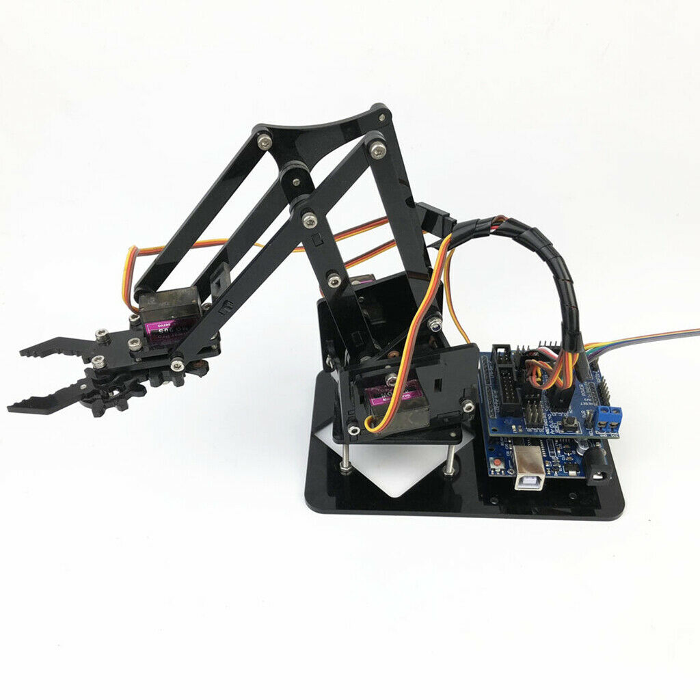

# Robotic Arm 4 DOF


## Czynności obowiązkowe
### Pobierz Arduino
Pobierz Arduino ze strony:
```https://www.arduino.cc/en/Main/Software```

Krótki opis czym jest Arduino znajdziesz na YouTube - [Kurs Arduino #1: Wstęp - Jak zacząć przygodę z Arduino (od podstaw)](https://www.youtube.com/watch?v=TzTmWqoN9i8) lub na forum Forbot - [Kurs Arduino – #1 – podstawy Arduino oraz środowisko](https://forbot.pl/blog/kurs-arduino-srodowisko-jak-zaczac-programowac-id936) w formie kursu. Zachęcam do zapoznania się z obiema wersjami.

Płytką z której będziesz korzystać będzie `Arduino Leonardo`.

Zapoznaj się z przykładem `blink` co pozwoli Ci zweryfikować poprawne zainstalowanie wszystkich składników oraz poprawne podłączenie do komputera.

### Sklonuj repozytorium
Przygotuj folder w którym będzie repozytorium oraz wejdź do tego folderu.

Aby sklonować repozytorium otwórz konsolę(jeden z poniższych sposobów):
- wpisz w `cmd` pasku adresu folderu(Windows Explorer)
- z menu kontekstowego po kliknięciu prawego przycisku myszki `Git BASH` .

W kosoli wpisz komendę:
```git clone https://github.com/abdarum/Elektroniczne_projekty.git```

### Wgraj i uruchom dedykowany program

Otwórz w Arduino IDE plik `Elektroniczne_projekty/Projekty/Robotic_Arm_4_DOF_kit/Robotic_Arm_4_DOF_kit.ino` oraz wgraj go na mikrokontroler upewniając się, że właściwa płytka została wybrana.

### Przeanalizuj wgrany kod 
Przeanalizuj zawartość pliku `Elektroniczne_projekty/Projekty/Robotic_Arm_4_DOF_kit/Robotic_Arm_4_DOF_kit.ino`, aby potrafić wytłumaczyć co się w którym momencie dzieje.

## Czynności dodatkowe
### Wygodniejsze edytowanie kodu
Pobierz i zainstaluj edytor tekstowy [Notepad++](https://notepad-plus-plus.org/downloads/).

Pobierz i zainstaluj IDE [Visual Studio Code](https://code.visualstudio.com/download).

Krótki opis instalacji znajdziesz na YouTube - [Visual Studio Code - instalacja - czym jest Visual Studio Code?](https://www.youtube.com/watch?v=CTje7OEjlXY)

Zainstaluj dodatki: [Arduino](https://marketplace.visualstudio.com/items?itemName=vsciot-vscode.vscode-arduino)
### Załóż konto GitHub i pobierz Git
_Konto na [GitHub](https://github.com/) pozwoli Ci na wprowadzanie zmian w istniejącym repozytorium oraz w tworzeniu własnych repozytoriów._

Załóź konto na portalu [GitHub](https://github.com/).

Pobierz i zainstaluj program Git z linku poniżej:
```https://gitforwindows.org/```

Pobierz i zainstaluj program
```http://gitextensions.github.io/```


